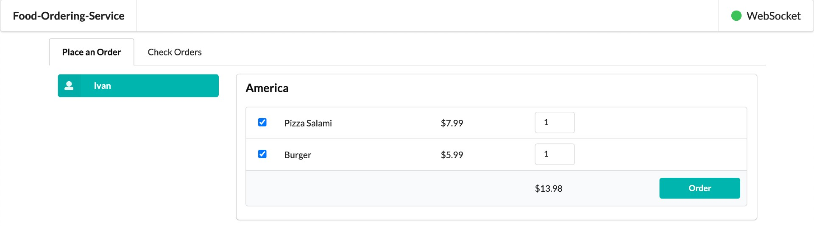

# axon-springboot-websocket

The goal of this project is to play with [`Axon`](https://axoniq.io/). For this, we will implement a `food-ordering` app that consists of three [`Spring Boot`](https://docs.spring.io/spring-boot/index.html) applications: `customer-service`, `restaurant-service`, and `food-ordering-service`. These services were implemented with [`CQRS`](https://martinfowler.com/bliki/CQRS.html) and [`Event Sourcing`](https://martinfowler.com/eaaDev/EventSourcing.html) in mind. To achieve this, we used the [`Axon Framework`](https://www.axoniq.io/products/axon-framework). The three services are connected to `axon-server`, which is the [`Event Store`](https://en.wikipedia.org/wiki/Event_store) and `Message Routing` solution used.

## Proof-of-Concepts & Articles

On [ivangfr.github.io](https://ivangfr.github.io), I have compiled my Proof-of-Concepts (PoCs) and articles. You can easily search for the technology you are interested in by using the filter. Who knows, perhaps I have already implemented a PoC or written an article about what you are looking for.

## Project Diagram


## Applications

- ### customer-service

  `Spring Boot` application that exposes a REST API to manage `Customers`. It also has a UI implemented using `JavaScript`, `jQuery`, and `Semantic UI`.
  
  
  
  `customer-service` was implemented using the `Axon Framework`. Every time a customer is added, updated, or deleted, the service emits the respective event, i.e., `CustomerAddedEvent`, `CustomerUpdatedEvent`, or `CustomerDeletedEvent`.
  
  `customer-service` uses `MySQL` to store customer data. Additionally, it listens to order events, collects the order information that it needs, and stores them in an order table present in its own database, so that it doesn't need to call another service to get this information.

- ### restaurant-service

  `Spring Boot` application that exposes a REST API to manage `Restaurants`. It also has a UI implemented using `JavaScript`, `jQuery`, and `Semantic UI`.
  
  
  
  `restaurant-service` was implemented using the `Axon Framework`. Every time a restaurant is added, updated, or deleted, the service emits the respective event, i.e., `RestaurantAddedEvent`, `RestaurantUpdatedEvent`, or `RestaurantDeletedEvent`. The same applies to the restaurant dishes, whose events are: `RestaurantDishAddedEvent`, `RestaurantDishUpdatedEvent`, or `RestaurantDishDeletedEvent`.
  
  `restaurant-service` uses `PostgreSQL` to store restaurant/dish data. Additionally, it listens to order events, collects the order information that it needs, and stores them in an order table present in its own database, so that it doesn't need to call another service to get this information.
  
- ### food-ordering-service

  `Spring Boot` application that exposes a REST API to manage `Orders`. It has a UI implemented using `JavaScript`, `jQuery`, and `Semantic UI`.
  
  
  
  `food-ordering-service` was implemented using the `Axon Framework`. Every time an order is created, the service emits the respective event, i.e., `OrderCreatedEvent`.
  
  `food-ordering-service` uses `MongoDB` to store order data. Additionally, it listens to customer and restaurant/dish events, collects the information that it needs, and stores them in a customer or restaurant/dish table present in its own database, so that it doesn't need to call another service to get this information.

- ### axon-event-commons

  `Maven` project where all events mentioned above are defined. It generates a JAR file that is added as a dependency in the `pom.xml` of `customer-service`, `restaurant-service`, and `food-ordering-service`.

## Prerequisites

- [`Java 17`](https://www.oracle.com/java/technologies/downloads/#java17) or higher;
- A containerization tool (e.g., [`Docker`](https://www.docker.com), [`Podman`](https://podman.io), etc.)

## Start Environment

- Open a terminal and inside the `axon-springboot-websocket` root folder run:
  ```bash
  docker compose up -d
  ```

- Wait for Docker containers to be up and running. To check it, run:
  ```bash
  docker ps -a
  ```

## Running applications with Maven

Inside the `axon-springboot-websocket` root folder, run the following commands in different terminals:

- **axon-event-commons**
  ```bash
  ./mvnw clean install --projects axon-event-commons
  ```

- **customer-service**
  ```bash
  ./mvnw clean spring-boot:run --projects customer-service -Dspring-boot.run.jvmArguments="-Dserver.port=9080"
  ```

- **restaurant-service**
  ```bash
  ./mvnw clean spring-boot:run --projects restaurant-service -Dspring-boot.run.jvmArguments="-Dserver.port=9081"
  ```

- **food-ordering-service**
  ```bash
  ./mvnw clean spring-boot:run --projects food-ordering-service -Dspring-boot.run.jvmArguments="-Dserver.port=9082"
  ```

## Running applications as Docker containers

- ### Build Docker images

  - In a terminal, make sure you are in the `axon-springboot-websocket` root folder;
  - Run the following script to build the Docker images:
    ```bash
    ./build-docker-images.sh
    ```

- ### Environment Variables

  - **customer-service**

    | Environment Variable | Description                                                           |
    |----------------------|-----------------------------------------------------------------------|
    | `MYSQL_HOST`         | Specify the host of the `MySQL` database to use (default `localhost`) |
    | `MYSQL_PORT`         | Specify the port of the `MySQL` database to use (default `3306`)      |
    | `AXON_SERVER_HOST`   | Specify the host of the `Axon Server` to use (default `localhost`)    |
    | `AXON_SERVER_PORT`   | Specify the port of the `Axon Server` to use (default `8124`)         |

  - **restaurant-service**

    | Environment Variable | Description                                                              |
    |----------------------|--------------------------------------------------------------------------|
    | `POSTGRES_HOST`      | Specify the host of the `Postgres` database to use (default `localhost`) |
    | `POSTGRES_PORT`      | Specify the port of the `Postgres` database to use (default `5432`)      |
    | `AXON_SERVER_HOST`   | Specify the host of the `Axon Server` to use (default `localhost`)       |
    | `AXON_SERVER_PORT`   | Specify the port of the `Axon Server` to use (default `8124`)            |

  - **food-ordering-service**

    | Environment Variable | Description                                                           |
    |----------------------|-----------------------------------------------------------------------|
    | `MONGODB_HOST`       | Specify the host of the `Mongo` database to use (default `localhost`) |
    | `MONGODB_PORT`       | Specify the port of the `Mongo` database to use (default `27017`)     |
    | `AXON_SERVER_HOST`   | Specify the host of the `Axon Server` to use (default `localhost`)    |
    | `AXON_SERVER_PORT`   | Specify the port of the `Axon Server` to use (default `8124`)         |

- ### Start Docker containers

  - In a terminal, make sure you are inside the `axon-springboot-websocket` root folder;
  - Run the following command:
    ```bash
    ./start-apps.sh
    ```

## Application URLs

| Application           | URL                   | Swagger                               |
|-----------------------|-----------------------|---------------------------------------|
| customer-service      | http://localhost:9080 | http://localhost:9080/swagger-ui.html |
| restaurant-service    | http://localhost:9081 | http://localhost:9081/swagger-ui.html |
| food-ordering-service | http://localhost:9082 | http://localhost:9082/swagger-ui.html |

## Demo

The GIF below shows a user creating a customer in the `customer-service` UI. Then, in the `restaurant-service` UI, they create a restaurant and add a dish. Finally, using the `food-ordering-service` UI, they submit an order using the customer and restaurant/dish created. Note that as soon as a customer or restaurant/dish is created, an event is sent, and the consumer of this event updates its UI in real-time using WebSockets.


## Useful Commands & Links

- **Axon Server**
  
  The `Axon Server` dashboard can be accessed at http://localhost:8024
  
  

- **MySQL**
  ```bash
  docker exec -it -e MYSQL_PWD=secret mysql mysql -uroot --database customerdb
  
  SELECT * FROM customers;
  SELECT * FROM orders;
  ```
  > Type `exit` to exit

- **PostgreSQL**
  ```bash
  docker exec -it postgres psql -U postgres -d restaurantdb
  
  SELECT * FROM restaurants;
  SELECT * FROM dishes;
  SELECT * FROM orders;
  ```
  > Type `\q` to exit
  
- **MongoDB**
  ```bash
  docker exec -it mongodb mongo foodorderingdb
  
  db.customers.find()
  db.restaurants.find()
  db.orders.find()
  ```
  > Type `exit` to exit

## Shutdown

- To stop applications:
    - If you start them with `Maven`, go to the terminals where they are running and press `Ctrl+C`;
    - If you start them as Docker containers, make sure you are inside the `axon-springboot-websocket` root folder and run the following script:
      ```bash
      ./stop-apps.sh
      ```
- To stop and remove docker compose containers, network, and volumes, go to a terminal and, inside the `axon-springboot-websocket` root folder, run the command below:
  ```bash
  docker compose down -v
  ```

## Cleanup

To remove the docker images created by this project, go to a terminal and, inside the `axon-springboot-websocket` root folder, run the following script:
```bash
./remove-docker-images.sh
```

## References

- https://sgitario.github.io/axon-by-example/
- https://blog.nebrass.fr/playing-with-cqrs-and-event-sourcing-in-spring-boot-and-axon/
